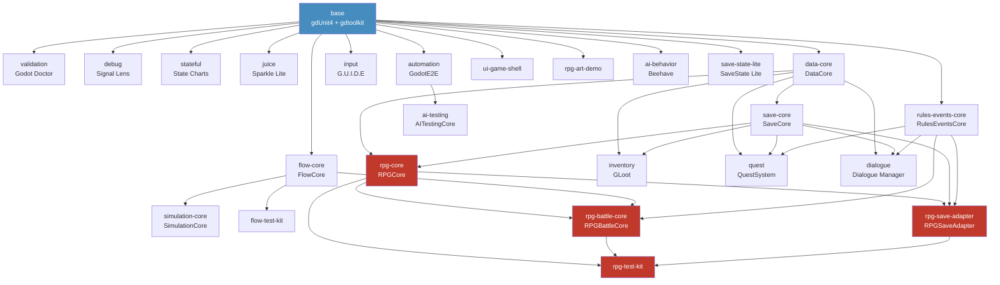

# godot-toolbox

    

> AI 原生 Godot 4.6+ 工程基线与插件 pack 组装控制仓库。

[English Documentation](README_EN.md)

---

## 目录

- [快速开始](#快速开始)
- [这个仓库做什么](#这个仓库做什么)
- [Pack 目录](#pack-目录)
- [依赖关系图](#依赖关系图)
- [一键部署（交互式）](#一键部署交互式)
- [验证](#验证)
- [维护](#维护)
- [贡献 & 许可](#贡献--许可)

---

## 快速开始

### 交互式一键部署（新用户推荐）

```bash
git clone https://github.com/codefromkarl/godot-toolbox.git
cd godot-toolbox

# 交互式向导，按分类浏览和选择 pack
./scripts/quickstart.sh /path/to/new-project
```

### 手动指定 pack 组装

```bash
./scripts/bootstrap_toolbox_project.sh /path/to/new-project --packs=validation,debug
```

预览 pack 组合产物（不写入文件）：

```bash
./scripts/bootstrap_toolbox_project.sh ../preview \
  --packs=flow-core,simulation-core,data-core,save-core,flow-test-kit \
  --dry-run-report
```

RPG pack 组合预览：

```bash
# 背包 + 数据 + 存档
./scripts/bootstrap_toolbox_project.sh ../preview \
  --packs=inventory,data-core,save-core --dry-run-report

# 任务 + 事件 + 存档
./scripts/bootstrap_toolbox_project.sh ../preview \
  --packs=quest,data-core,save-core,rules-events-core --dry-run-report

# 完整 RPG 栈
./scripts/bootstrap_toolbox_project.sh ../preview \
  --packs=rpg-core,rpg-battle-core,rpg-save-adapter,rpg-test-kit,flow-core,data-core,save-core,rules-events-core \
  --dry-run-report
```

---

## 这个仓库做什么

**设计原则：**

- **默认最小化** — 只启用适合自动化和 CI 的基线能力
- **复杂度按需引入** — 玩法、调试、表现层插件做成可选 pack，不强绑到每个新项目
- **Vendored 分离** — 第三方 addon 与仓库自有脚本、测试、文档分离管理
- **按价值选型** — 优先看自动化价值、复用面、耦合度和维护成本，而非功能数量

**核心特性：**

- **Manifest 驱动组装** — `packs.manifest.json` 定义每个 pack 的依赖、autoload、冲突和验证入口
- **上游版本锁定** — `upstreams.lock.json` 锁定所有 vendored 插件的精确 git ref
- **预集成测试** — 基线模板内置 gdUnit4 + godot-gdscript-toolkit，CI-ready
- **CI 流水线** — 每次推送自动运行 Godot 4.6.2 headless import + gdUnit4 smoke
- **架构 pack** — 工具箱自有 autoload 合约，覆盖 flow、data、save、rules、RPG 等
- **验证套件** — 分层脚本验证 manifest 合约、bootstrap 产物和 pack 一致性

**这个仓库不是：**

- 不是官方 Godot demo 镜像
- 不是单一游戏 starter 模板
- 是 **选择 → 锁定版本 → 组装 → 验证 → 发行** 的控制仓库

---

## Pack 目录

### 基线 Pack（始终包含）

| Pack | 插件 | 用途 |
|------|------|------|
| `base` | gdUnit4 6.1.2, godot-gdscript-toolkit 4.5.0 | 测试 + 代码检查基线 |

### 开发工具（仅依赖 base）

| Pack | 插件 | 版本 | 何时启用 |
|------|------|------|----------|
| `validation` | Godot Doctor | 2.1.2 | 需要把场景/资源约束纳入 CI |
| `debug` | Signal Lens | 1.4.1 | Signal 密集型项目，需要可视化调试 |
| `stateful` | Godot State Charts | 0.22.3 | 复杂状态机架构 |
| `juice` | Sparkle Lite | 1.0.0 | Game-feel 和反馈 authoring |
| `ai-behavior` | Beehave | 2.9.2 | 行为树 AI（NPC/敌人） |
| `save-state-lite` | SaveState Lite | 1.2.0 | 独立存档工具（⚠️ 与 save-core 冲突） |

### 输入 & 自动化

| Pack | 插件 | 版本 | 何时启用 |
|------|------|------|----------|
| `input` | G.U.I.D.E | 0.12.0 | 跨设备输入映射与提示图标 |
| `automation` | GodotE2E | 1.1.0 | 运行时 UI/E2E 自动化（pytest bridge） |

### 架构核心（自研）

| Pack | Autoload | 依赖 | 用途 |
|------|----------|------|------|
| `flow-core` | `FlowCore` | base | 游戏模式栈、Flow 请求和结果合约 |
| `simulation-core` | `SimulationCore` | flow-core | Tick 调度器，长生命周期状态管理 |
| `data-core` | `DataCore` | base | 数据注册表与稳定 ID 合约 |
| `save-core` | `SaveCore` | data-core | 版本化快照与原子 JSON 写入 |
| `rules-events-core` | `RulesEventsCore` | base | 事件/条件/效果执行 spine |
| `ui-game-shell` | — | base | 菜单、暂停、modal 和 loading 壳层 |
| `flow-test-kit` | — | flow-core | Flow smoke fixture 与 gdUnit4 测试 |
| `ai-testing` | `AITestingCore` | automation | AI 驱动的测试探索与覆盖率追踪 |

### 游戏系统（第三方 Vendor）

| Pack | 插件 | 版本 | 依赖 | 何时启用 |
|------|------|------|------|----------|
| `inventory` | GLoot | 3.0.1 | data-core, save-core | 背包与装备槽 |
| `quest` | QuestSystem | 2.0.1.4 | data-core, save-core, rules-events-core | 资源化任务管理 |
| `dialogue` | Dialogue Manager | 3.10.4 | data-core, save-core, rules-events-core | 对话图/文本资源 |

### RPG 扩展（自研）

| Pack | Autoload | 依赖 | 用途 |
|------|----------|------|------|
| `rpg-core` | `RPGCore` | data-core, save-core | 角色/队伍/钱包/装备状态 |
| `rpg-battle-core` | `RPGBattleCore` | rpg-core, flow-core, rules-events-core | 确定性回合制战斗 |
| `rpg-save-adapter` | `RPGSaveAdapter` | rpg-core, save-core, rules-events-core | RPG 存档适配 |
| `rpg-test-kit` | — | rpg-core, rpg-battle-core, rpg-save-adapter | 战斗回放/事件流/状态转储 |
| `rpg-art-demo` | — | base | 占位美术/音频 scaffold |

---

## 依赖关系图



完整 autoload 合约和扩展依赖图见 [docs/architecture.md](docs/architecture.md)。

---

## 一键部署（交互式）

`scripts/quickstart.sh` 提供交互式部署向导，自动处理依赖解析和冲突检测。

### 交互模式（默认）

```bash
./scripts/quickstart.sh /path/to/new-project
```

向导会：

1. 按分类展示所有可选 pack
2. 接受用户选择（逗号分隔的 pack ID）
3. 自动解析依赖（BFS 向上收集 requires）
4. 检测冲突（如 save-state-lite vs save-core）
5. 显示最终 pack 列表 + 依赖关系摘要
6. 确认后调用 `bootstrap_toolbox_project.sh` 执行组装

### 非交互模式（CI/自动化）

```bash
./scripts/quickstart.sh /path/to/new-project --packs=validation,debug --auto-deps
```

`--auto-deps` 自动解析依赖，然后调用 `bootstrap_toolbox_project.sh`。

---

## 验证

### 本地验证链

```bash
bash ./scripts/verify_toolbox_layout.sh
bash ./scripts/verify_game_architecture_packs.sh
bash ./scripts/verify_rules_events_core_pack.sh
bash ./scripts/verify_ui_game_shell_pack.sh
bash ./scripts/verify_pack_matrix.sh --all
bash ./scripts/verify_specialized_pack_candidates.sh
bash ./scripts/verify_input_pack_poc.sh
bash ./scripts/verify_bootstrap_flow.sh
```

`verify_bootstrap_flow.sh` 创建临时项目，叠加默认 packs（`validation,debug,stateful,juice`），然后：

1. Bootstrap 临时项目
2. `godot --headless --editor --quit-after 1 --import`
3. 生成项目内 gdUnit4 smoke

CI 运行相同流程。当前 workflow 使用官方 Linux Godot `4.6.2`。本地保持 `4.6.x`。如果 Godot 不在 `PATH`，设置 `GODOT_BIN=/path/to/godot`。

### 可选 pack 验证

```bash
bash ./scripts/verify_automation_pack_poc.sh
bash ./scripts/verify_dialogue_pack.sh
```

---

## 维护

### 导入新上游插件

```bash
./scripts/import_plugin_from_upstream.sh \
  --id=signal_lens \
  --repo=https://github.com/yannlemos/signal-lens \
  --target=packs/debug/godot/addons/signal_lens \
  --pack=debug \
  --version=1.4.1
```

### 升级已锁定插件

```bash
# 预览升级（dry-run）
./scripts/update_plugin_from_upstream.sh --id=signal_lens --version=1.4.1 --dry-run

# automation pack 上游升级
./scripts/update_plugin_from_upstream.sh --id=godot_e2e --dry-run

# shell 候选 pack 上游升级
./scripts/update_plugin_from_upstream.sh --id=maaacks_game_template --dry-run
```

---

## 贡献 & 许可

参见 [CONTRIBUTING.md](CONTRIBUTING.md)：

- **Pack 提案** — 使用 Pack Request 模板开 issue
- **提交规范** — Conventional Commits（`feat:`, `fix:`, `docs:`, `test:`, `chore:`）
- **PR 检查清单** — manifest/lock 一致性、验证脚本通过

本项目使用 **MIT License** — 详见 [LICENSE](LICENSE)。

`packs/*/godot/addons/` 中的第三方插件保留各自原始许可证。
完整归属摘要见 [docs/rpg-vendor-license-notice.md](docs/rpg-vendor-license-notice.md)。

---

## RPG 模板方向

RPG 相关第三方来源、vendor 版本、本地路径、吸收边界和后续任务清单见：

- `docs/rpg-template-absorption-plan.md`
- `docs/rpg-template-quickstart.md`
- `docs/rpg-pack-recipes.md`
- `docs/rpg-art-asset-sources.md`
- `docs/rpg-vendor-license-notice.md`
- `docs/rpg-experience-review.md`

当前已吸收为非默认 pack 的来源：

- `GLoot`：<https://github.com/peter-kish/gloot>
- `QuestSystem`：<https://github.com/shomykohai/quest-system>
- `Beehave`：<https://github.com/bitbrain/beehave>
- `SaveState Lite`：<https://github.com/youssof20/savestate>
- `Dialogue Manager`：<https://github.com/nathanhoad/godot_dialogue_manager>

RPG 核心规则已自研落地，包括 `rpg-core`、`rpg-battle-core`、`rpg-save-adapter` 和 `rpg-test-kit`。
这些内容负责角色成长、战斗规则、奖励、队伍状态和存档格式，不应由第三方插件直接持有项目真相。
