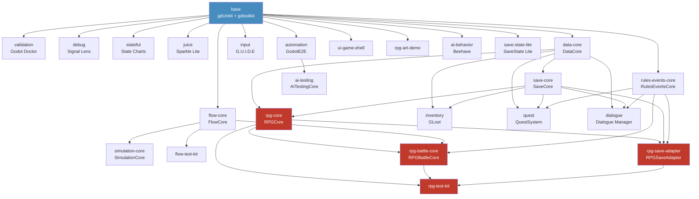

# godot-toolbox

    

> AI-native Godot 4.6+ bootstrap control plane. 24 curated plugin packs, manifest-driven assembly, CI-verified contracts, optional RPG scaffolds.

[中文说明](README.md)

---

## Table of Contents

- [Quick Start](#quick-start)
- [What It Does](#what-it-does)
- [Pack Catalog](#pack-catalog)
- [Architecture](#architecture)
- [Interactive Deployment](#interactive-deployment)
- [Verification](#verification)
- [Maintenance](#maintenance)
- [Contributing](#contributing)
- [License](#license)

---

## Quick Start

### Interactive deployment (recommended for new users)

```bash
git clone https://github.com/codefromkarl/godot-toolbox.git
cd godot-toolbox

# Interactive wizard — browse packs by category
./scripts/quickstart.sh /path/to/new-project
```

### Manual pack assembly

```bash
./scripts/bootstrap_toolbox_project.sh /path/to/new-project --packs=validation,debug
```

Preview pack assembly without writing files:

```bash
./scripts/bootstrap_toolbox_project.sh ../preview \
  --packs=flow-core,simulation-core,data-core,save-core,flow-test-kit \
  --dry-run-report
```

RPG pack combination previews:

```bash
# Inventory + data + save
./scripts/bootstrap_toolbox_project.sh ../preview \
  --packs=inventory,data-core,save-core --dry-run-report

# Quest + events + save
./scripts/bootstrap_toolbox_project.sh ../preview \
  --packs=quest,data-core,save-core,rules-events-core --dry-run-report

# Full RPG stack
./scripts/bootstrap_toolbox_project.sh ../preview \
  --packs=rpg-core,rpg-battle-core,rpg-save-adapter,rpg-test-kit,flow-core,data-core,save-core,rules-events-core \
  --dry-run-report
```

---

## What It Does

**Design Principles:**

- **Minimal by default** — only CI-friendly baseline capabilities are enabled
- **Opt-in complexity** — gameplay, debug, and presentation plugins are optional packs, never forced into every project
- **Vendored separation** — third-party addons are isolated from repo-owned scripts, tests, and docs
- **Selection by value** — plugins are evaluated on automation value, reuse breadth, coupling, and maintenance cost, not feature count

**Key Features:**

- **Manifest-driven assembly** — `packs.manifest.json` defines every pack's dependencies, autoloads, conflicts, and verification entry points
- **Upstream version locking** — `upstreams.lock.json` pins exact git refs for all vendored plugins
- **Pre-integrated testing** — gdUnit4 + godot-gdscript-toolkit in the base template, CI-ready from day one
- **CI pipeline** — Godot 4.6.2 headless import + gdUnit4 smoke on every push
- **Architecture packs** — toolbox-owned autoload contracts for flow, data, save, rules, RPG, and more
- **Verification suite** — layered scripts validate manifest contracts, bootstrap artifacts, and pack consistency

**What this repo is NOT:**

- Not an official Godot demo mirror
- Not a single-game starter template
- It is a **select → pin → assemble → verify → ship** control plane

---

## Pack Catalog

### Baseline Pack (always included)

| Pack | Plugins | Purpose |
|------|---------|---------|
| `base` | gdUnit4 6.1.2, godot-gdscript-toolkit 4.5.0 | Testing + linting baseline |

### Developer Tools (base only)

| Pack | Plugin | Version | When to Enable |
|------|--------|---------|----------------|
| `validation` | Godot Doctor | 2.1.2 | Scene/resource constraint CI validation |
| `debug` | Signal Lens | 1.4.1 | Signal-heavy projects needing visual flow debugging |
| `stateful` | Godot State Charts | 0.22.3 | Complex state machine architecture |
| `juice` | Sparkle Lite | 1.0.0 | Game-feel and feedback authoring |
| `ai-behavior` | Beehave | 2.9.2 | Behavior tree AI for NPCs/enemies |
| `save-state-lite` | SaveState Lite | 1.2.0 | Advanced save tooling and browser (**conflicts: save-core**) |

### Input & Automation

| Pack | Plugin | Version | When to Enable |
|------|--------|---------|----------------|
| `input` | G.U.I.D.E | 0.12.0 | Cross-device input mapping and prompt icons |
| `automation` | GodotE2E | 1.1.0 | Runtime UI/E2E testing via pytest bridge |

### Architecture Packs (Toolbox-owned)

| Pack | Autoload | Requires | Purpose |
|------|----------|----------|---------|
| `flow-core` | `FlowCore` | base | Game mode stack, flow requests, and result contracts |
| `simulation-core` | `SimulationCore` | flow-core | Tick scheduler and system contracts for long-lived state |
| `data-core` | `DataCore` | base | Data registry with stable ID contracts |
| `save-core` | `SaveCore` | data-core | Versioned snapshots and atomic JSON writes |
| `rules-events-core` | `RulesEventsCore` | base | Event, condition, and effect execution spine |
| `ui-game-shell` | — | base | Menu, pause, modal, and loading shell primitives |
| `flow-test-kit` | — | flow-core | Flow smoke fixtures and gdUnit4 test suites |
| `ai-testing` | `AITestingCore` | automation | AI-driven test exploration and coverage tracking |

### Game Systems (Third-party Vendor)

| Pack | Plugin | Version | Requires | When to Enable |
|------|--------|---------|----------|----------------|
| `inventory` | GLoot | 3.0.1 | data-core, save-core | Inventory/equipment slot authoring |
| `quest` | QuestSystem | 2.0.1.4 | data-core, save-core, rules-events-core | Resource-driven quest management |
| `dialogue` | Dialogue Manager | 3.10.4 | data-core, save-core, rules-events-core | Dialogue graph authoring and playback |

### RPG Extensions (Toolbox-owned)

| Pack | Autoload | Requires | Purpose |
|------|----------|----------|---------|
| `rpg-core` | `RPGCore` | data-core, save-core | RPG character, party, wallet, and equipment state |
| `rpg-battle-core` | `RPGBattleCore` | rpg-core, flow-core, rules-events-core | Deterministic turn-based battle contracts |
| `rpg-save-adapter` | `RPGSaveAdapter` | rpg-core, save-core, rules-events-core | RPG state → save-core serialization |
| `rpg-test-kit` | — | rpg-core, rpg-battle-core, rpg-save-adapter | Battle replay, event stream, and state dump evidence |
| `rpg-art-demo` | — | base | First-party placeholder art/audio scaffold |

---

## Architecture



For the full expanded dependency graph with autoload contracts, see [docs/architecture.md](docs/architecture.md).

---

## Interactive Deployment

`scripts/quickstart.sh` provides an interactive deployment wizard with automatic dependency resolution and conflict detection.

### Interactive mode (default)

```bash
./scripts/quickstart.sh /path/to/new-project
```

The wizard will:

1. Display all available packs grouped by category
2. Accept user selection (comma-separated pack IDs)
3. Automatically resolve dependencies (BFS upward requires collection)
4. Detect conflicts (e.g. save-state-lite vs save-core)
5. Display final pack list + dependency summary
6. Call `bootstrap_toolbox_project.sh` on confirmation

### Non-interactive mode (CI/automation)

```bash
./scripts/quickstart.sh /path/to/new-project --packs=validation,debug --auto-deps
```

`--auto-deps` enables automatic dependency resolution, then calls `bootstrap_toolbox_project.sh`.

---

## Verification

### Local verification chain

```bash
bash ./scripts/verify_toolbox_layout.sh
bash ./scripts/verify_game_architecture_packs.sh
bash ./scripts/verify_rules_events_core_pack.sh
bash ./scripts/verify_ui_game_shell_pack.sh
bash ./scripts/verify_pack_matrix.sh --all
bash ./scripts/verify_specialized_pack_candidates.sh
bash ./scripts/verify_input_pack_poc.sh
bash ./scripts/verify_bootstrap_flow.sh
```

`verify_bootstrap_flow.sh` creates a temporary project, overlays default packs (`validation,debug,stateful,juice`), then runs:

1. Bootstrap the temporary project
2. `godot --headless --editor --quit-after 1 --import`
3. Generate and run project-local gdUnit4 smoke

CI runs the same pipeline. The current workflow uses official Linux Godot `4.6.2`. Locally, keep `4.6.x`. If Godot is not in `PATH`, set `GODOT_BIN=/path/to/godot`.

### Optional pack verification

```bash
bash ./scripts/verify_automation_pack_poc.sh
bash ./scripts/verify_dialogue_pack.sh
```

---

## Maintenance

### Import a new upstream plugin

```bash
./scripts/import_plugin_from_upstream.sh \
  --id=signal_lens \
  --repo=https://github.com/yannlemos/signal-lens \
  --target=packs/debug/godot/addons/signal_lens \
  --pack=debug \
  --version=1.4.1
```

### Update a pinned upstream plugin

```bash
# Preview update (dry-run)
./scripts/update_plugin_from_upstream.sh --id=signal_lens --version=1.4.1 --dry-run

# Update automation pack upstream
./scripts/update_plugin_from_upstream.sh --id=godot_e2e --dry-run

# Update candidate shell pack upstream
./scripts/update_plugin_from_upstream.sh --id=maaacks_game_template --dry-run
```

---

## Contributing

See [CONTRIBUTING.md](CONTRIBUTING.md) for the full guide:

- **Pack proposals** — open an issue with the Pack Request template
- **Commit convention** — Conventional Commits (`feat:`, `fix:`, `docs:`, `test:`, `chore:`)
- **PR checklist** — manifest/lock consistency, verification scripts pass

---

## License

This project is licensed under the **MIT License** — see [LICENSE](LICENSE).

Third-party plugins vendored in `packs/*/godot/addons/` retain their original licenses.
See [docs/rpg-vendor-license-notice.md](docs/rpg-vendor-license-notice.md) for the complete attribution summary.
