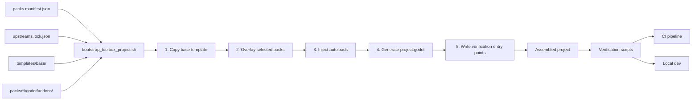
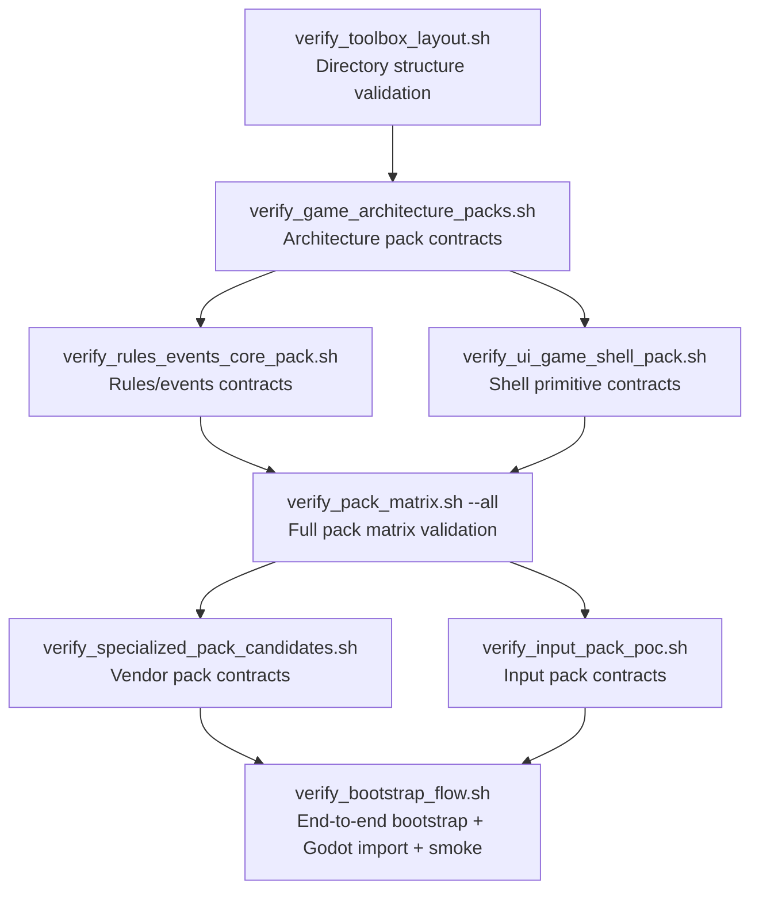
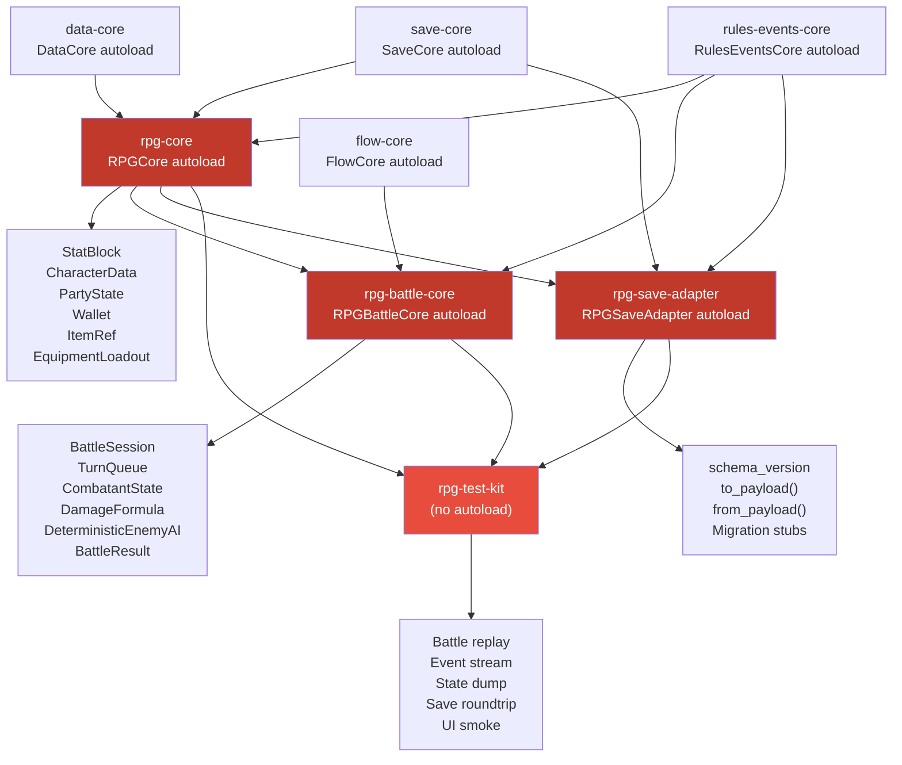

# Architecture

## Overview

godot-toolbox is an AI-native Godot 4.6+ bootstrap control plane. It does not ship a game — it ships a **select → pin → assemble → verify → ship** pipeline that composes curated plugin packs into verified project scaffolds.

**Design philosophy:**

- **Minimal by default** — base template includes only gdUnit4 + gdtoolkit
- **Opt-in complexity** — every additional pack is explicitly selected
- **Vendored separation** — third-party addons live in isolated `godot/addons/` subtrees
- **Contract verification** — every pack has a verification script that validates manifest entries, autoloads, and bootstrap artifacts

## Pack Assembly Pipeline



### Bootstrap Steps

1. **Copy base template** — `templates/base/` provides the project skeleton with gdUnit4 and gdtoolkit pre-configured
2. **Overlay selected packs** — each selected pack's `godot/addons/` directory is copied on top
3. **Inject autoloads** — singleton scripts defined in `packs.manifest.json` are added to `project.godot`
4. **Generate project.godot** — combines base settings with pack-specific settings and autoload registrations
5. **Write verification entry points** — test scripts from each pack's `verification` field are copied into the project

## Full Pack Dependency Graph

```mermaid
graph TD
    BASE["base<br/><i>baseline</i><br/>gdUnit4 + gdtoolkit"]

    BASE --> VALID["validation<br/><i>optional-pack</i><br/>Godot Doctor 2.1.2"]
    BASE --> DEBUG["debug<br/><i>optional-pack</i><br/>Signal Lens 1.4.1"]
    BASE --> STATE["stateful<br/><i>optional-pack</i><br/>State Charts 0.22.3"]
    BASE --> JUICE["juice<br/><i>optional-pack</i><br/>Sparkle Lite 1.0.0"]
    BASE --> AUTO["automation<br/><i>optional-pack</i><br/>GodotE2E 1.1.0"]
    BASE --> INPUT["input<br/><i>optional-pack</i><br/>G.U.I.D.E 0.12.0"]
    BASE --> FLOW["flow-core<br/><i>architecture-core</i>"]
    BASE --> DATA["data-core<br/><i>architecture-core</i>"]
    BASE --> RULES["rules-events-core<br/><i>architecture-core</i>"]
    BASE --> SHELL["ui-game-shell<br/><i>optional-pack</i>"]
    BASE --> ART["rpg-art-demo<br/><i>optional-pack</i>"]

    FLOW --> SIM["simulation-core<br/><i>architecture-core</i>"]
    FLOW --> FTK["flow-test-kit<br/><i>architecture-test-kit</i>"]
    DATA --> SAVE["save-core<br/><i>architecture-core</i>"]
    AUTO --> AITEST["ai-testing<br/><i>architecture-test-kit</i>"]

    DATA --> RPGC["rpg-core<br/><i>architecture-core</i>"]
    SAVE --> RPGC
    RPGC --> RPGB["rpg-battle-core<br/><i>architecture-core</i>"]
    FLOW --> RPGB
    RULES --> RPGB
    RPGC --> RPGSA["rpg-save-adapter<br/><i>architecture-core</i>"]
    SAVE --> RPGSA
    RULES --> RPGSA
    RPGC --> RPGTK["rpg-test-kit<br/><i>architecture-test-kit</i>"]
    RPGB --> RPGTK
    RPGSA --> RPGTK

    DATA --> INV["inventory<br/><i>optional-pack</i><br/>GLoot 3.0.1"]
    SAVE --> INV
    DATA --> QUEST["quest<br/><i>optional-pack</i><br/>QuestSystem 2.0.1.4"]
    SAVE --> QUEST
    RULES --> QUEST
    DATA --> DIALOG["dialogue<br/><i>optional-pack</i><br/>Dialogue Manager 3.10.4"]
    SAVE --> DIALOG
    RULES --> DIALOG
    BASE --> BEH["ai-behavior<br/><i>optional-pack</i><br/>Beehave 2.9.2"]
    BASE --> SSL["save-state-lite<br/><i>optional-pack</i><br/>SaveState Lite 1.2.0"]

    %% Styling
    style BASE fill:#478cbf,color:#fff,stroke:#333
    style VALID fill:#3498db,color:#fff
    style DEBUG fill:#3498db,color:#fff
    style STATE fill:#3498db,color:#fff
    style JUICE fill:#3498db,color:#fff
    style AUTO fill:#3498db,color:#fff
    style INPUT fill:#3498db,color:#fff
    style FLOW fill:#27ae60,color:#fff
    style DATA fill:#27ae60,color:#fff
    style SAVE fill:#27ae60,color:#fff
    style SIM fill:#27ae60,color:#fff
    style RULES fill:#27ae60,color:#fff
    style SHELL fill:#27ae60,color:#fff
    style FTK fill:#f39c12,color:#fff
    style AITEST fill:#f39c12,color:#fff
    style RPGC fill:#c0392b,color:#fff
    style RPGB fill:#c0392b,color:#fff
    style RPGSA fill:#c0392b,color:#fff
    style RPGTK fill:#e74c3c,color:#fff
    style ART fill:#3498db,color:#fff
    style INV fill:#3498db,color:#fff
    style QUEST fill:#3498db,color:#fff
    style DIALOG fill:#3498db,color:#fff
    style BEH fill:#3498db,color:#fff
    style SSL fill:#3498db,color:#fff
```



**Legend:**
- 🔵 Blue — Optional vendor packs
- 🟢 Green — Architecture-core packs (toolbox-owned)
- 🟡 Orange — Architecture test kits
- 🔴 Red — RPG architecture packs

## Autoload Contracts

| Pack | Autoload Singleton | Path | Notes |
|------|-------------------|------|-------|
| `automation` | `AutomationServer` | `res://addons/godot_e2e/automation_server.gd` | TCP bridge for pytest E2E |
| `ai-testing` | `AITestingCore` | `res://addons/godot_toolbox_architecture/ai_testing/ai_testing.gd` | Strategy-driven exploration |
| `input` | `GUIDE` | `res://addons/guide/guide.gd` | Cross-device input context |
| `flow-core` | `FlowCore` | `res://addons/godot_toolbox_architecture/flow_core/flow_core.gd` | Game mode stack |
| `simulation-core` | `SimulationCore` | `res://addons/godot_toolbox_architecture/simulation_core/simulation_core.gd` | Tick scheduler |
| `data-core` | `DataCore` | `res://addons/godot_toolbox_architecture/data_core/data_core.gd` | Data registry |
| `save-core` | `SaveCore` | `res://addons/godot_toolbox_architecture/save_core/save_core.gd` | Snapshot persistence |
| `rules-events-core` | `RulesEventsCore` | `res://addons/godot_toolbox_architecture/rules_events_core/rules_events_core.gd` | Event/condition/effect spine |
| `rpg-core` | `RPGCore` | `res://addons/godot_toolbox_architecture/rpg_core/rpg_core.gd` | RPG domain state |
| `rpg-battle-core` | `RPGBattleCore` | `res://addons/godot_toolbox_architecture/rpg_battle_core/rpg_battle_core.gd` | Turn-based battle |
| `rpg-save-adapter` | `RPGSaveAdapter` | `res://addons/godot_toolbox_architecture/rpg_save_adapter/rpg_save_adapter.gd` | RPG → save serialization |
| `save-state-lite` | `SaveManager` | `res://addons/savestate/save_manager.gd` | Alternative save tooling |

## Verification Pipeline



Each verification script checks:

1. **Manifest consistency** — pack entries have required fields, dependencies are valid
2. **File existence** — autoload scripts, plugin.cfg, and addon directories exist
3. **Bootstrap artifacts** — dry-run report matches expected autoloads and project settings
4. **Runtime contracts** — gdUnit4 smoke tests verify autoload APIs

## RPG Architecture



### RPG Pack Dependency Chain

```
data-core + save-core → rpg-core → rpg-battle-core (also needs flow-core + rules-events-core)
                          rpg-core → rpg-save-adapter (also needs save-core + rules-events-core)
                          rpg-core + rpg-battle-core + rpg-save-adapter → rpg-test-kit
```

### Third-Party RPG Packs (Optional)

Vendor packs that integrate with the RPG architecture through adapters:

| Pack | Upstream | Adapter Boundary |
|------|----------|-----------------|
| `inventory` | GLoot | `RPGGLootAdapter` maps `ItemRef` to GLoot payloads |
| `quest` | QuestSystem | Quest state bridged through `rules-events-core` + `save-core` |
| `ai-behavior` | Beehave | `RPGBeehaveAIAdapter` optional for battle AI |
| `save-state-lite` | SaveState Lite | **Conflicts** with `save-core` — isolated alternative |

## Conflict Rules

| Pack | Conflicts With | Reason |
|------|---------------|--------|
| `save-core` | `save-state-lite` | Both expose a `SaveSlot` global class |
